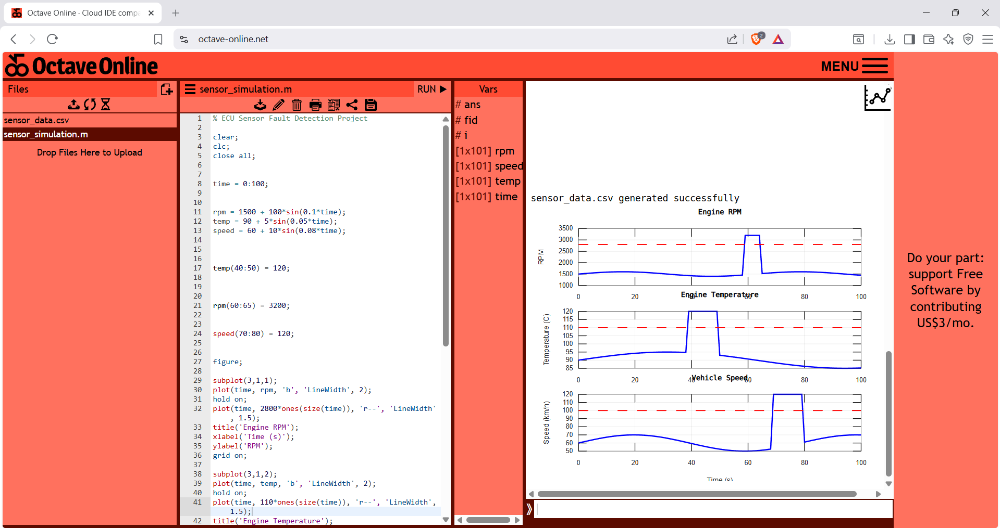
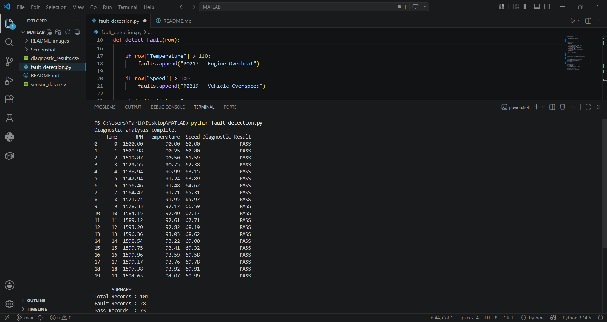

# ECU Sensor Fault Detection System

**Parth Girish Joshi**  
MIT ADT University | B.Tech CSE

## What is this project?

This project detects faults in vehicle sensor data.  
It reads RPM, Temperature and Speed — and checks if any value crosses the limit.  
If it does — it gives a fault code. If not — it shows PASS.

## Fault Logic

| Sensor | Limit | Fault Code |
|--------|-------|------------|
| RPM | > 2800 | P0016 |
| Temperature | > 110°C | P0217 |
| Speed | > 100 km/h | P0219 |

## MATLAB Simulation

Sensor signals are generated using MATLAB/Octave.  
Red line = fault limit. Blue line = actual sensor value.




## Python Output


Total Records : 101
Fault Records : 28
Pass Records  : 73

## How to Run

```bash
pip install pandas
python fault_detection.py
```

---

## Tech Used
- Python, Pandas
- MATLAB / Octave
- Git, GitHub
